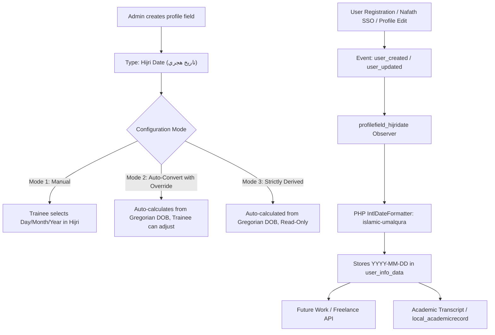

# Implementation Plan: `moodle-profilefield_hijridate`

## Overview
This plan specifies the architecture, class design, data structures, and implementation steps for **`profilefield_hijridate`**, a native Moodle custom profile field plugin.

- **Frankenstyle Component**: `profilefield_hijridate`
- **Plugin Type**: `profilefield` (User Profile Field Subsystem)
- **Target Repository**: `https://github.com/Smartlearn-edu/moodle-profilefield_hijridate.git`
- **Local Path**: `/home/mohammad/Dev/plugins/profiles/hijridate`
- **Moodle Installation Path**: `/user/profile/field/hijridate`
- **Compatible Versions**: Moodle 4.1+ through 5.x
- **Author**: Mohammad Nabil `<mohammad@smartlearn.education>`
- **License**: GNU GPL v3 or later

---

## Key Features & Capabilities



1. **Native Moodle Profile Field**:
   - Appears directly in **Site Administration $\rightarrow$ Users $\rightarrow$ User profile fields** under *"Create a new profile field"*.
2. **Official Saudi Umm al-Qura Calendar Engine**:
   - Built on PHP's native `IntlDateFormatter` with calendar identifier `islamic-umalqura` (accurate astronomical Saudi civil calendar).
   - Zero external Composer dependencies required.
3. **Smart Conversion & Auto-Population**:
   - Automatically derives the Hijri Date of Birth (`YYYY-MM-DD`) from any Gregorian date field (standard Moodle DOB or custom field).
   - **Allows manual override**: Protects against the $\pm 1$ day discrepancy between astronomical algorithms and physical Saudi Civil Registry cards (الأحوال المدنية).
4. **Standardized API Format**:
   - Stores and exports canonical `YYYY-MM-DD` (e.g. `1394-02-04`), directly compatible with government & regulatory APIs (Future Work / Freelance Portal, Absher, Yakeen).
5. **Bulk Migration / Backfill CLI**:
   - Includes `cli/backfill.php` to auto-calculate and populate Hijri dates for thousands of existing registered students in one command.

---

## Directory & File Structure

```
user/profile/field/hijridate/
├── version.php                    # Moodle plugin metadata, maturity, and version
├── define.class.php               # Admin configuration form when defining the field
├── field.class.php                # Display, form rendering, and data preprocessing
├── lib.php                        # Plugin callbacks and hooks
├── classes/
│   ├── helper/
│   │   └── umalqura.php           # Core Umm al-Qura conversion & month name definitions
│   ├── observer/
│   │   └── user_observer.php      # Listens to user_created & user_updated for auto-sync
│   └── privacy/
│       └── provider.php           # Moodle GDPR / Privacy API compliance
├── db/
│   ├── events.php                 # Registers event listeners for auto-conversion
│   └── upgrade.php                # Database upgrade steps (if required in future)
├── lang/
│   ├── en/
│   │   └── profilefield_hijridate.php # English strings
│   └── ar/
│       └── profilefield_hijridate.php # Arabic strings (تقويم أم القرى / تاريخ هجري)
├── cli/
│   └── backfill.php               # CLI tool to backfill existing users
└── tests/
    └── umalqura_test.php          # PHPUnit tests for date conversion accuracy
```

---

## Detailed File Specifications

### 1. `version.php`
```php
<?php
defined('MOODLE_INTERNAL') || die();

$plugin->version   = 2026092500;
$plugin->requires  = 2022112800; // Moodle 4.1+
$plugin->component = 'profilefield_hijridate';
$plugin->maturity  = MATURITY_STABLE;
$plugin->release   = 'v1.0 (Build 2026092500)';
```

### 2. `define.class.php` (`profile_define_hijridate`)
Extends `profile_define_base`.
Handles field creation in the Moodle admin interface:
- **`param1` (Start Year)**: Minimum Hijri year (e.g. 1340 AH - default: 1350 AH).
- **`param2` (End Year)**: Maximum Hijri year (e.g. 1470 AH - default: current Hijri year + 5).
- **`param3` (Conversion Mode)**:
  - `0`: Manual Hijri selector only.
  - `1`: Auto-convert from Gregorian date (editable override allowed).
  - `2`: Auto-convert and lock (read-only derived field).
- **`param4` (Source Field)**:
  - Specifies which Gregorian date source to watch (e.g., standard Moodle DOB or custom profile field).
- **`param5` (Display Format)**:
  - `iso`: `1394-02-04` (standard for APIs).
  - `text`: `4 صفر 1394 هـ` (formal Arabic text).
  - `both`: `1394-02-04 (4 صفر 1394 هـ)`.

### 3. `field.class.php` (`profile_field_hijridate`)
Extends `profile_field_base`.
- **`edit_field_add($mform)`**:
  - Adds 3 clean dropdown elements:
    - `Day`: 1 to 30.
    - `Month`: 1 to 12 (with localized names: محرم, صفر, ربيع الأول...).
    - `Year`: Selectable from `param1` to `param2`.
  - If auto-conversion is enabled, embeds unobtrusive JavaScript to auto-select the Hijri values when the Gregorian DOB picker changes.
- **`edit_save_data_preprocess($data, $datarecord)`**:
  - Combines the selected day, month, and year into canonical `YYYY-MM-DD` string format (e.g. `1394-02-04`).
  - Validates that the year, month, and day are valid integers.
- **`display_data()`**:
  - Formats output for the user's profile view according to `param5`.

### 4. `classes/helper/umalqura.php`
Encapsulates all calendar mathematics:
- `gregorian_to_hijri(int|string $time): array`:
  - Uses `new \IntlDateFormatter('en_US@calendar=islamic-umalqura', ...)` to get:
    - `year`: e.g. `1394`
    - `month`: e.g. `2`
    - `day`: e.g. `4`
    - `formatted`: e.g. `'1394-02-04'`
    - `month_name_ar`: e.g. `'صفر'`
    - `month_name_en`: e.g. `'Safar'`
- `hijri_to_gregorian(int $year, int $month, int $day): ?int`:
  - Reverse converter using `\IntlCalendar::createInstance('Asia/Riyadh', 'en_US@calendar=islamic-umalqura')`.
- `get_months(?string $lang = null): array`:
  - Returns array of 12 official Hijri months in Arabic and English.

### 5. `classes/observer/user_observer.php`
- Listens to:
  - `\core\event\user_created`
  - `\core\event\user_updated`
- If a user has a Gregorian date but their `hijridate` field is empty (or in auto-sync mode):
  - Calculates the Umm al-Qura date.
  - Updates `{user_info_data}` using `$DB->set_field()` or `profile_save_data()`.

### 6. `cli/backfill.php`
Command-line utility for site administrators:
```bash
php user/profile/field/hijridate/cli/backfill.php --field=dob_hijri --override=0
```
- Iterates over all active users in the database.
- Calculates and populates the Hijri date for users who have a Gregorian date recorded.
- Displays progress bar and execution summary.

---

## Verification & Testing Plan

1. **Unit Tests (`tests/umalqura_test.php`)**:
   - Test benchmark dates (e.g. 1974-05-15 $\rightarrow$ 1394-04-22).
   - Test leap year edge cases in Umm al-Qura calendar.
2. **Form Interaction Tests**:
   - Create a field in Moodle admin with start year 1340 and end year 1460.
   - Edit user profile: select a Hijri date, save, and verify value stored in `{user_info_data}` is `YYYY-MM-DD`.
3. **Auto-Conversion Tests**:
   - Update user's Gregorian DOB, verify `user_updated` observer populates the Hijri field.
4. **Moodle Standards Compliance**:
   - Validate full GPL headers on all PHP files.
   - Run `phpcs` to verify adherence to Moodle coding style.
